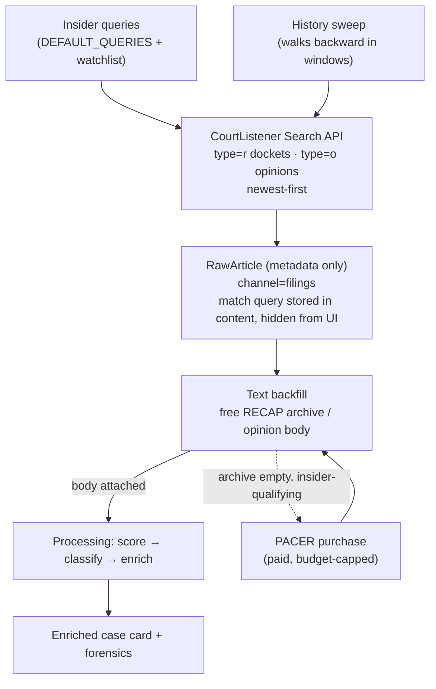

# How the ingest finds court documents

This explains where the court filings in the corpus come from: what gets
searched, whether it's newest-only or retroactive, the exact search terms, and
how a case goes from a search hit to a fully-enriched card.

**One-line answer:** it is **query-driven, not a scan.** We never look at "all
new filings." We send a fixed set of insider-threat search queries to
CourtListener, and it returns only the cases that match. Coverage is both
**forward (newest)** and **retroactive (a rolling historical sweep)**.

All code lives in `apps/aggregator/courtlistener.py` (the API client + query
lists) and `apps/aggregator/courtlistener_pipeline.py` (the three ingest jobs).

## What is searched

CourtListener is the [Free Law Project](https://www.courtlistener.com/) search
service. We query two corpora, both mapped to `channel="filings"`:

| Corpus | API type | What it is |
|---|---|---|
| **RECAP dockets** | `type=r` | Federal case dockets (complaints, indictments, motions) |
| **Case-law opinions** | `type=o` | Published court opinions / decisions |

⚠️ **US courts only.** CourtListener indexes US federal (and some state) courts.
A non-US entity is matched only by *US* filings that name it — there is no
foreign-court coverage. (This is why the `Voya India` watchlist entry catches
US-side litigation mentioning Voya India, not Indian court records.)

Results are always ordered **newest-filed first** (`order_by=dateFiled desc`).

## The search terms

There are three query sets, all hand-authored and cross-referenced to the
Insider Threat Matrix (ITM) — none are AI-generated or auto-derived from the
ITM at runtime.

### 1. Topic queries — `DEFAULT_QUERIES` (`courtlistener.py`)

The core insider lexicon, run on every forward pull. Overridable via
`COURTLISTENER_QUERIES` (env); empty = these defaults:

- `"insider trading"`
- `"trade secret" (employee OR contractor OR "former employee")`
- `"economic espionage"`
- `"computer fraud" (employee OR contractor OR insider)`
- moonlighting / concurrent-employment / dual-employment / outside-employment /
  conflict-of-interest cluster (projects ITM technique **IF038**, "Undisclosed
  Concurrent Employment")
- `"scattered spider"`, `"sim swap" (fraud OR conspiracy OR indictment)`,
  `"help desk" ("social engineering" OR impersonation OR credentials)`
- device/telemetry attribution forensics (`"device identifier"`, `telemetry`,
  GDID-class affidavits)

### 2. Company watchlist — `COURTLISTENER_COMPANY_WATCHLIST`

Default `Voya, Voya India`. Each company name is expanded by
`company_watchlist_queries()` into **two** queries and appended to both the
docket and opinion lanes:

- **Scoped** — `"Voya" (employee OR "former employee" OR contractor OR insider OR "trade secret" OR misappropriation OR "economic espionage" OR fraud OR embezzlement OR "data breach" OR confidential OR proprietary)` — the on-topic cases, low noise.
- **Catch-all** — bare `"Voya"` — every US filing that names it.

Add companies by editing the setting (one comma-separated list); empty disables.

### 3. History rotation — `history_rotation_queries()` (`courtlistener_pipeline.py`)

The retroactive sweep now covers the **full** `DEFAULT_QUERIES` set — not a
hand-picked subset — so historically-old cases in *every* topic (including
social-engineering / sim-swap / device-identifier, the Scattered-Spider class)
actually get swept. To stay under CourtListener's shared 10/min throttle, each
run fires only a **rotation slice** of `COURTLISTENER_HISTORY_QUERIES_PER_WINDOW`
queries (default 4; 0 = all); the previously-skipped queries lead the rotation
so the gap they left fills first. The date cursor does not advance until every
slice of the current window has run, so each window is still fully covered — just
over several runs. Raise the per-window count once `COURTLISTENER_API_TOKEN`
lifts the rate limit.

## The three ways cases enter the corpus

### A. Forward incremental pull — `run_courtlistener_ingestion`

The main lane, run every refresh. **Newest cases.**

- Runs topic queries + watchlist queries against dockets and opinions.
- **Incremental via a watermark:** each type stores a `filed_after` date in the
  ingest state; the next run only asks for cases filed since then, minus
  `COURTLISTENER_LOOKBACK_DAYS` of overlap so nothing filed near the boundary is
  missed. A first run with no watermark pulls the newest page.
- De-dupes by link across queries, so a case matching several queries is stored
  once.

### B. Retroactive historical sweep — `run_courtlistener_history_sweep`

This is the **retroactive** part. It walks **backward in time**, one window per
refresh, so the corpus gradually seeds years of past prosecutions with no manual
steps.

- A cursor starts at today and moves back in `COURTLISTENER_HISTORY_WINDOW_DAYS`
  steps until it reaches `COURTLISTENER_HISTORY_FLOOR` (the oldest date to seed).
  Disabled when the floor is unset.
- Uses the full rotated query set (see §3), `filed_after`/`filed_before`
  bounding each window; the cursor advances only once the window's whole
  rotation has run.
- **Metadata only** — it does not fetch document bodies here; those come later
  via the text backfill (C).
- A throttled window does **not** advance the cursor, so nothing is skipped —
  it retries that window next run.
- You can also run windows manually:
  `python -m apps.aggregator sweep_courtlistener_history --windows N`.

### C. Full-text backfill — `run_courtlistener_text_backfill`

Search hits arrive as **metadata only** (case name, court, docket #, parties).
This job attaches the actual **document body** so the case can be scored and
enriched properly.

- Finds stored CourtListener rows with no body yet and pulls their text from the
  **free RECAP archive** (`is_available=true`) — the complaint/indictment leads.
- Opinion rows fetch the full opinion body from the cluster detail.
- **Never triggers a purchase.** Text that isn't in the free archive yet is
  simply skipped and retried after 7 days (RECAP uploads trickle in).
- When a body lands, the row is force-refreshed (fresh `ingested_at`) so the
  next processing run re-scores and re-enriches it over the full document.

### (D. PACER purchasing — separate, paid, strictly gated)

If the free archive has no text for an insider-qualifying docket,
`pacer_purchase.py` can buy it via CourtListener's RECAP Fetch API. This
**spends real money** and is gated by credentials **and** a budget cap
(`PACER_QUARTERLY_BUDGET_CENTS`, default under PACER's $30/quarter fee waiver).
No credentials = no-op. It is never part of normal flagging — only a last resort
for qualifying cases the free archive came up empty on.

## End-to-end: one case's journey

## Is the filing text preserved, or does enrichment replace it?

**The full filing text is always preserved. Enrichment is purely additive — it
never overwrites, replaces, or deletes the document body.**

- The backfilled document body is stored in the processed row's **`clean_text`**
  field (up to the ingest caps: 40k chars for RECAP dockets, 20k for opinions).
- Enrichment **reads** `clean_text` as input and **writes** its output to
  *separate* fields — `ai_summary` (the analyst note), `forensics` (the
  structured record), `case_record` (legacy view). It does not touch
  `clean_text` (`process_pipeline.py` passes `text=row.clean_text` in, and only
  stamps the new fields on the way out).
- **Re-enrichment keeps the text too.** When a row is re-enriched (e.g. the
  model changed), only the derived LLM fields are cleared and regenerated
  (`_clear_llm_fields` clears `ai_summary` / `case_record` / `forensics` only);
  `clean_text` is never in that set. A regression test asserts the full body
  survives a reprocess.
- The API serves the full `clean_text` body for court cases, so the raw filing
  stays readable alongside the analyst note — the summary is shown *with* the
  text, not *instead of* it.

**One nuance (truncation of the LLM's *input*, not the stored text):** when a
filing is enriched, the model only *reads* the first
`SUMMARIZER_FILINGS_MAX_INPUT_CHARS` characters (default **36,000**) to keep the
prompt bounded. The stored/searchable `clean_text` still holds the full body —
truncation applies only to what the LLM sees, never to what is kept. If you want
enrichment to consider more of a very long filing, raise that setting (stored
bodies go up to the 40k RECAP cap). Nothing is lost either way.

## Rate limits & pacing

CourtListener throttles these endpoints at **10 requests/minute account-wide**.
All lanes share that budget, so requests are paced by
`COURTLISTENER_REQUEST_DELAY_SECONDS` (default 7s ≈ 8.5/min with margin), and a
429 is honored (the response says when the bucket refills) rather than hammered.
This is why the history sweep does one window per refresh and the text backfill
caps attempts per run — the shared budget is spread across search, backfill, and
any purchases.

## Quick reference — knobs

| Setting | Effect |
|---|---|
| `COURTLISTENER_QUERIES` | Override the topic query list (empty = `DEFAULT_QUERIES`) |
| `COURTLISTENER_OPINION_QUERIES` | Separate query list for opinions (empty = falls back to the above) |
| `COURTLISTENER_COMPANY_WATCHLIST` | Company names → scoped + catch-all queries (default `Voya, Voya India`) |
| `COURTLISTENER_TYPES` | `dockets`, `opinions`, or `all` |
| `COURTLISTENER_LOOKBACK_DAYS` | Overlap window re-pulled on each incremental run |
| `COURTLISTENER_HISTORY_FLOOR` | Oldest date the retroactive sweep seeds back to (unset = sweep off) |
| `COURTLISTENER_HISTORY_WINDOW_DAYS` | Size of each backward window |
| `COURTLISTENER_HISTORY_QUERIES_PER_WINDOW` | Rotation queries per run (default 4; 0 = all). Raise once a token lifts the throttle |
| `COURTLISTENER_API_TOKEN` | Free Law Project token — raises the rate limit above anonymous; set it even without PACER |
| `COURTLISTENER_REQUEST_DELAY_SECONDS` | Pacing between requests (429 protection) |
| `COURTLISTENER_API_TOKEN` | Free Law Project token (higher anonymous rate limits) |

## What this means for coverage

- **Newest cases:** covered continuously by the forward pull (A).
- **Historical cases:** covered by the backward sweep (B), gradually, bounded by
  the floor date.
- **Blind spots:** anything **no query matches** never enters — coverage equals
  the query list. A new insider pattern needs a new query (or a watchlist
  company); there is no semantic discovery at the CourtListener stage. Non-US
  court records are out of scope entirely.
